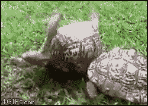

class: top

```{r xaringan-themer, include=FALSE, warning=FALSE}
library(xaringanthemer) # Custom 'xaringan' CSS Themes # Custom 'xaringan' CSS Themes
style_duo_accent(
  colors = c(
    red = "red",
    purple = "#3e2f5b",
    lightpurple = "#DCD0FF",
    lavender = "#967bb6",
    violet = "#8A2BE2",
    periwinkle = "#ccccff",
    orange = "#FF5733", # Orange - Innovation and Excitement
    green = "#136f63", # Teal - Creativity and Growth
    white = "#FFFFFF",
    yellow = "yellow", # Yellow - Optimism and Energy:
    gold = "gold",
    turquoise = "#00C5CD", # Turquoise - Balance and Clarity:
    aquamarine = "#7FFFD4",
    teal = "#2c8475",
    darkgreen = "#006400",
    forestgreen = "forestgreen",
    firebrick = "firebrick",
    lightcoral = "lightcoral",
    black = "black",
    charcoal = "#36454F",
    purple = "#7030A0", # Purple (#7030A0) - Imagination and Open-mindedness
    blue = "#0070C0", #Blue - Persuasion and Trust:
    cornflowerblue = "cornflowerblue",
    deepskyblue = "deepskyblue",
    dodgerblue = "dodgerblue",
    steelblue = "steelblue",
    royalblue = "royalblue"),
  primary_color = "black",  
  secondary_color = "#FFFFFF",
  # secondary_color = "yellow",
  black_color = "#000004",
  white_color = "#FFFFFF",
  base_font_size = "20px",
  text_font_family = "Jost",
  text_font_url = "https://indestructibletype.com/fonts/Jost.css",
  header_font_google = google_font("Roboto Slab", "400", "700"),
  header_font_weight = "400",
  inverse_background_color = "black",
  # inverse_header_color = "#eaeaea",
  inverse_header_color = "#FFFFFF",
  title_slide_text_color = "#FFFFFF",
  text_slide_number_color = "#FFFFFF",
  text_bold_color = "#FF5733",
  code_inline_color = "#FFFFFF",
  code_highlight_color = "transparent",
  link_color = "lightcoral",
  text_color = "#FFFFFF",
  header_color = "#FFFFFF",
  background_color = "black",
  blockquote_left_border_color = "steelblue",
  # table_row_even_background_color = lighten_color("white", 0.9),
  extra_fonts = list(
    "https://indestructibletype.com/fonts/Jost.css",
    google_font("Amatic SC", "400"))
  
)

```


```{r LIBRARIES, echo=FALSE, include=FALSE, warning=FALSE}
####
library(ggplot2) 
library(tibble) 
library(tidyr) 
library(readr) 
library(purrr) 
library(dplyr) 
library(stringr) 
library(forcats) 
library(lubridate) 
####
library(xaringan) 
library(xaringanExtra) 
library(xaringanthemer) 
library(countdown) 
library(htmltools) 
library(htmlwidgets) 
library(here) 
library(knitr) 
library(kableExtra) 
library(DT) 
library(shrtcts) 
```

```{r xaringanExtra, echo = FALSE, warning = FALSE}
xaringanExtra::use_animate_css()
xaringanExtra::use_animate_all("fade")
xaringanExtra::use_banner()
xaringanExtra::use_clipboard()
xaringanExtra::use_editable(expires = 1)
xaringanExtra::use_extra_styles()
xaringanExtra::use_fit_screen()
# xaringanExtra::use_freezeframe()
xaringanExtra::use_panelset()
xaringanExtra::use_progress_bar()
xaringanExtra::use_scribble()
xaringanExtra::use_search()
xaringanExtra::use_share_again()
# xaringanExtra::use_slide_tone()  # not yet a feature I like
xaringanExtra::use_tile_view()
xaringanExtra::use_webcam()
xaringanExtra::use_tachyons()

```

```{r xarington Countdown WHEN YOU NEED ONE, echo=FALSE}
# countdown::countdown(
#           minutes = 0,
#           seconds = 90,
#           warn_when = 5
#           style = "position: relative; width: min-content; margin: 1em auto;",
#           top = 0, bottom = 0,
#           left = 0, right = 0,
#           margin = "5%",
#           font_size = "8em",
#           color_running_background = "#31b09e",
#           color_warning_background = "#f79334",
#           color_finished_background = "#b56b6f",
#           color_finished_text = "#eaeaea"
#           # Fanfare when it's over
#           play_sound = TRUE
#
```

```{r setup, include=FALSE}
options(htmltools.dir.version = FALSE, htmltools.preserve.raw = FALSE)
knitr::opts_chunk$set(echo = FALSE)

```

```{css CSS-Code, echo=FALSE}

```

# Today's workshop is brought to you by the letter .f-5.y.b["U"] 

.center[
<br>

.f-5.b[.y["Unique!"]]
]

.pull-right[


]

---
class: left middle

.f-6[# WHY ARE WE HERE?]

---
class: middle

.pull-left[

.f-5.y[To]  
<span style="font-size: 120px;">**LEARN**</span>

]

.pull-right[


]

---
class:   

.pull-left[

.f1.y[
to have <span style="font-size: 140px;">**FUN**</span>]


]

.pull-right[


]

---
class:   

.pull-right[
<br>
<br>

.f1.y[And, to] 

<span style="font-size: 65px;">**MAKE A DIFFERENCE!**</span>
]

.pull-left.absolute.left-2.top-2[


]

---
class: bg-purple middle center     

<span style="font-size: 100px; font-weight: 400;">This workshop is designed specifically to help you .y.b[succeed]; so you can .tq.b[make a difference]

</span>

---
.f1.left[About me:]
.f1.y.b.i.right[Willberforce McGuillicuddy]

.left-column[]


.right-column[

.f2[I help business owners create .tq[prosperity] and .tq[fulfillment] for themselves and others by

.f2[teaching them how to be even more .y[Unique, ] .o[Capable,] and .tq[Effective]]

]
]

---
class: top

# How to contact me:

<br>
<br>
<br>

.center.f1.tq[`r fontawesome::fa("phone")` (888) 888-8888]  

<br>
<br>

.center.f1.tq[`r fontawesome::fa("envelope", a11y = "sem")` mack.aroni@sauce.com]


---
class: middle center

.f-5[Mission = Create Happy Customers]


---
class: middle left     

<span style="font-size: 100px; font-weight: 400;">THE CHALLENGE WE ALL FACE...</span>

---
class: top center

<br>

.f1[Is to be .b.y[Unique] in the marketplace]]

--

<br>
.f1[More .y[Unique] = .tq[more successful.]]

--

<br>
.f1[Being .b.y[different] is more important than you think!]

---
class: middle center     

<span style="font-size: 100px; font-weight: 400;">.lc[Contrast] is .b.y[Power]</span>

---

<br>
# The best way to .lc[contrast] with your competitors

--

<br>
.f1.center[ is to be .lc[very] .b.tq[Effective] + very .b.o[Capable]]

--

.f1.y.right[from your customer's point of view]

---
class: top  

.pull-left[
.f-5[.y[Unique] means]
]

<br>
<br>
.f1.center.lc[Standing out in a crowd]


---
class: top  

.pull-left[
.f-5[.y[Unique] means]

<br>
<br>
.f1[being .b.lc[unconventional]]
]

.pull-right[

<br>
]

---
class:

.f1.left[Avoid .red[conventional logic] because all your competitors will use that]

--

<br>
<br>
.f1.right.y[Test counter-intuitive ideas because your competitors won't]

---
class: middle left     

<span style="font-size: 100px; font-weight: 400;">Why This Works...</span>

---
class:

.f1[The unstoppable .lc[chain reaction]:]

--

<br>
.left.f1[Become .tq[Effective], then]

--

<br>
.right.f1[Build your .o[Capability] to deliver]

--

<br>
.f1.center[And you will be irresistibly .y[UNIQUE]]

---
class: middle center

.f-5[What does it mean to be .tq["effective?"]]

---
class: top  

.f-5.tq[Effective] 

--

.f2[means .y.b[knowing] what is .lc[VALUABLE] to customers - .o[in their terms]]

--

.f2[and having the .y[capability] to deliver it .o[upon demand]]

---
class: top center  

.f-5.b[.tq[Effective] means...]

--

<br>

.f1.bottom.b[.f-5[Strictly] .o[from the customer's point of view]]

---
class:  


.f1[Your efforts must be .tq[Useful,] ] 

--

.f1.center[.tq[Fulfill a desire], or]

--

.f1.right[.tq[Solve a problem]]

--

.f1[From the .y[customer's point of view]]

---
class: middle center    


.f-5.b.tq[Effective ] .f1[does .b.lc[NOT] mean <br>

.f-5.red[Expedient]]

---
class:  

.f1.b.red[Expedient =]


.f1.right[.lc[Quick, ] .lc[Interim ] or .lc[Temporary]]

<br>
.f1.center[.lc[Short-term], often at the expense of the long-term]


.f1.left[.lc[Putting out fires,] .f1[often] .red[at the expense of the customer]
]

---
class: top center  

# Strangely, the opposite is .red[NOT] true:

.f-5[.lc[Efficient] &ne; .tq[Effective]
]

--

.f1.y[Become more .tq[effective] you will .white[automatically] become more .lc[efficient]]

---
.f-5[.lc[Productive] &ne; .tq[Effective]
]

--

.f1.y[As you become more .tq[effective] you will .white[automatically] become more .lc[productive]]

---
class:  top center

# But, don't just take my word for it...

--

# Let's hear what .y[Warren Buffet] thinks about .tq[effectiveness] in delighting customers

<br>

.f1[
<a href="vid/buffet-on-customer-delight.mp4" target="_blank">Warren Buffet on Delighting Customers <br>30 sec</a>
]

---
class: middle center     

.royalblue[
<span style="font-size: 100px; font-weight: 400;">Some Cold, Hard Facts...</span>
]


---
class: center

<br>

# .tq[Half] of new businesses .red[fail] in .o[5 years].  

--

<br>

# By .tq[year 10] fully .red[two-thirds] are .o[gone].  

--

<br>

# Only .red[10%] make it to .o[20 years].  

---
class:  


<br>

.f1[Studies and surveys also show shocking .red[failure rates] for .tq[improvement initiatives] that can range from 


.center.f1[.red[50% to 70%] or **even higher.**]]

---
class:

# Companies that fail are .red[not]: 

# * .y[Unique] enough, 

# * .o[Capable] enough, or

# * .tq[Effective] enough

<br>
# .right.lc[from the customer's point of view]


